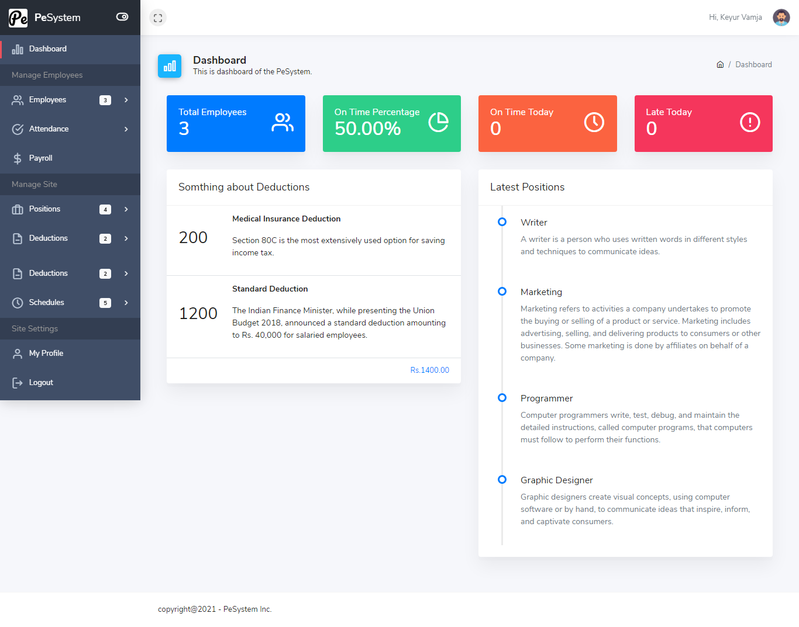
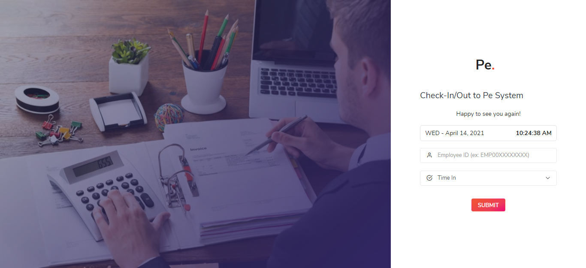
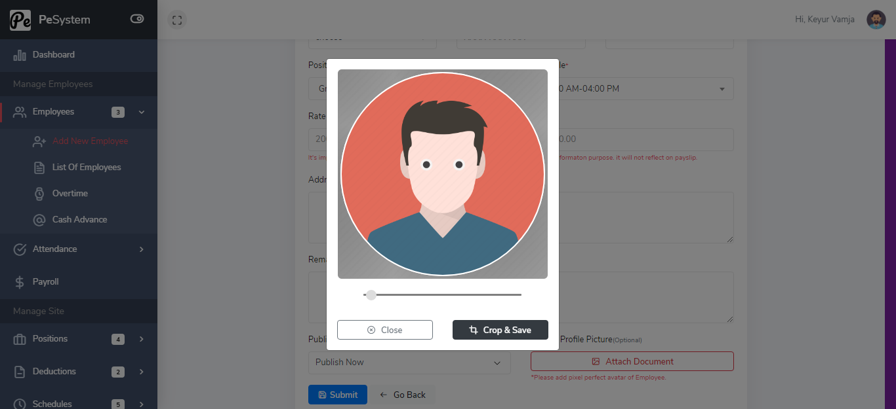
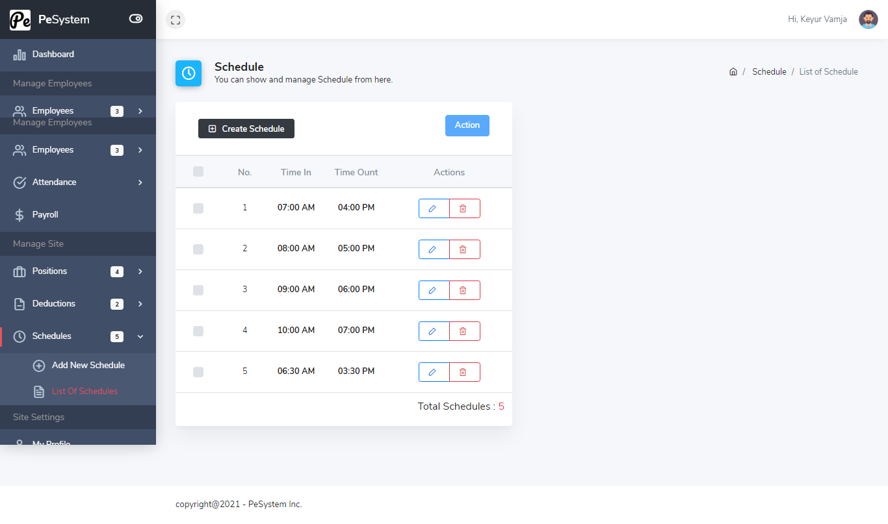
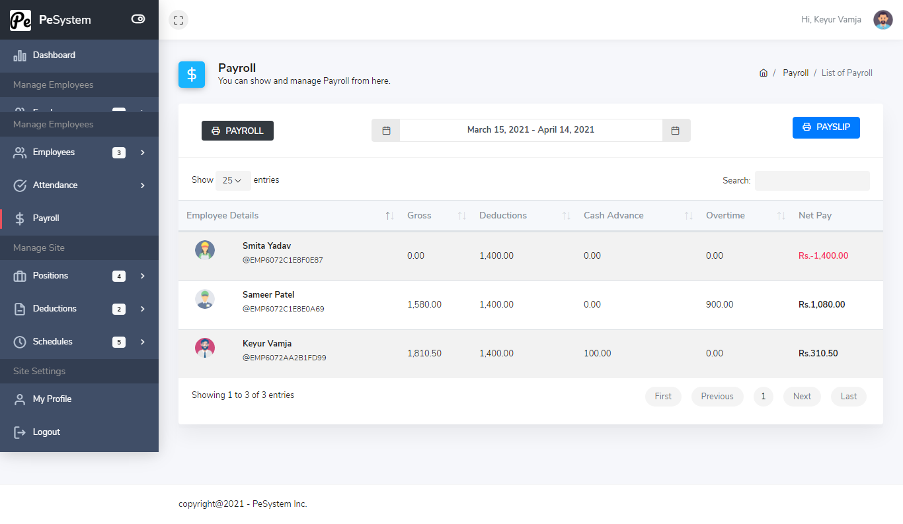
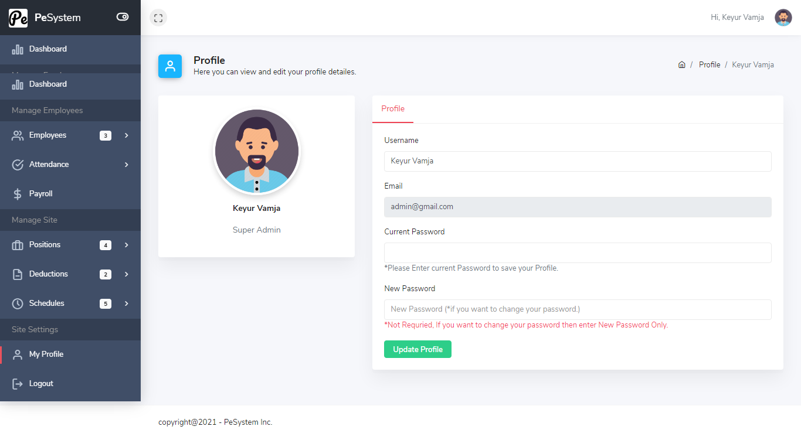

## Laravel Payroll System (Current: Laravel 5.8.*)

### Introduction
---
The Laravel Payroll System gives you a huge head start on any web application of any sort. It comes with a full-featured access control system that is simple to use right out of the box. I put a lot of effort into it, and I hope it will be useful to you and save you time!

### Setup
---
Clone the repo and follow below steps.
1. Run `composer install`
2. Copy `.env.example` to `.env`
3. Set valid database credentials of env variables `DB_DATABASE`, `DB_USERNAME`, and `DB_PASSWORD`
4. Run `php artisan key:generate` to generate application key
5. Run `php artisan migrate --seed`
6. Run `php artisan serve` as per your environment

### Demo Credentials
---
*Make sure database is seed before you use these credentials.*

**User:** admin@gmail.com
**Password:** 123456

## ScreenShots

## Dashboard

## Employee Checkin/Out

## Employee Create

## Schedule

## Payroll

## Admin Profile

## Issues
If you have any issues please report them [here](https://github.com/helloKeyur/PayrollSystem/issues).

## Contribution
Please feel free to make any project-related pull requests. You should give us an email at the following addresses if you wish to propose any new updates or features to the project.

    1. Keyur Vamja - keyur.vamja.it@gmail.com
